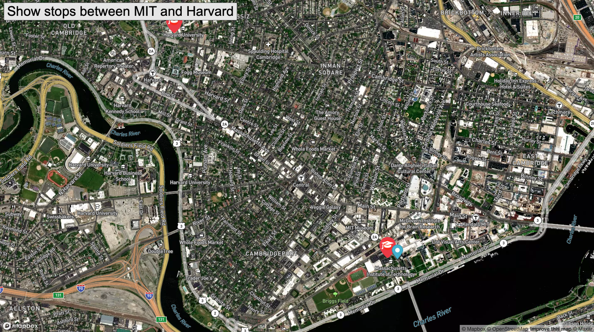

# Real-Time-Bus-Tracker

## Description:

I am working on an assignment as part of the all-women cohort of MIT's full (MERN) stack development bootcamp. This program imports a map of Boston from Mapbox, creates two permanent markers for the MIT and Harvard campuses. Animation is added to track the bus as it stops between MIT and Harvard and uses html, CSS, JavaScript, and a first introduction to Mapbox.

## Installation:

To get started drag and drop the index.html file into Google Chrome or your prefered web browser. Make sure all the other files are in the same folder. You'll need to insert set up an insert your own mapbox tolken on line 49 of the mapanimation.js file in order to pull in the map.

## Usage

For fun and practice with importing APIs. Use as you wish.

## Licensing:

Massachusetts Institute of Technology (MIT) (C)John Williams 2020. See LICENSE for more details.

## Roadmap:

I hope create similar projects for other cities cities and make other future improvements to this code as I become more familar with available APIs and customize the images.
